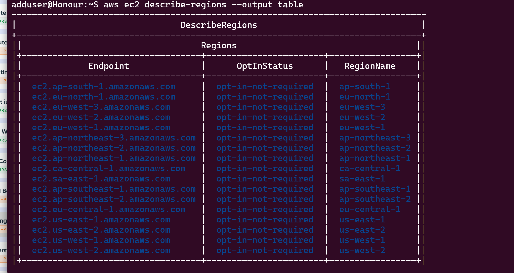

# Mini Project - Setting Up Secure Authentication to AWS API

## Overview

This project documents the step-by-step process of setting up secure authentication to the AWS API using IAM roles, policies, and users, followed by installation and configuration of the AWS CLI. The setup enables scripts to interact with AWS services (EC2 and S3), laying the foundation for automating cloud resource management.

---

## 1. AWS IAM Setup

### 1.1 Create an IAM Role

- **Purpose:** To encapsulate the permissions needed for automation tasks.
- **Steps:**
  1. Go to AWS Console → IAM → Roles → "Create Role".
  2. Choose "AWS Service" as trusted entity (e.g., EC2).
  3. Proceed without attaching a policy for now; name the role (e.g., `AutomationRole`).

### 1.2 Create an IAM Policy

- **Purpose:** To grant full access to EC2 and S3.
- **Policy Example:**
  ```json
  {
    "Version": "2012-10-17",
    "Statement": [
      {
        "Effect": "Allow",
        "Action": [
          "ec2:*",
          "s3:*"
        ],
        "Resource": "*"
      }
    ]
  }
  ```
- **Steps:**
  1. AWS Console → IAM → Policies → "Create Policy".
  2. Paste the above JSON; name as `EC2S3FullAccess`.

### 1.3 Create an IAM User

- **Purpose:** To serve as the identity for script/API interactions.
- **Steps:**
  1. AWS Console → IAM → Users → "Add User".
  2. Username: `automation_user`.
  3. Select "Programmatic access".

### 1.4 Assign the User to the IAM Role

- **Purpose:** To inherit the permissions defined in the role.
- **Steps:**
  - If used with EC2, assign role during instance launch.
  - For direct API usage, attach policies to the user.

### 1.5 Attach the IAM Policy to the User

- **Purpose:** To grant explicit permissions for EC2 and S3 management.
- **Steps:**
  1. IAM → Users → `automation_user` → "Add permissions".
  2. Attach existing policy: `EC2S3FullAccess`.

### 1.6 Create Programmatic Access Credentials

- **Purpose:** To authenticate CLI/API requests.
- **Steps:**
  1. After user creation, download or copy Access Key ID and Secret Access Key.
  2. **Keep these credentials secure.**

---

## 2. Installing AWS CLI

### On Linux

1. **Download AWS CLI:**
   ```bash
   curl "https://awscli.amazonaws.com/awscli-exe-linux-x86_64.zip" -o "awscliv2.zip"
   unzip awscliv2.zip
   sudo ./aws/install
   ```
2. **Verify Installation:**
   ```bash
   aws --version
   ```

### On Windows

1. Download MSI installer from [AWS CLI download page](https://docs.aws.amazon.com/cli/latest/userguide/getting-started-install.html).
2. Run installer and follow instructions.
3. Verify with:
   ```
   aws --version
   ```

### On macOS

1. Download the macOS `.pkg` installer from AWS.
2. Run installer and follow instructions.
3. Verify with:
   ```
   aws --version
   ```

---

## 3. Configuring AWS CLI

1. Open your terminal and run:
   ```
   aws configure
   ```
   
2. Enter the following when prompted:
   - **AWS Access Key ID:** From `automation_user`
   - **AWS Secret Access Key:** From `automation_user`
   - **Default region name:** e.g., `us-east-1`
   - **Default output format:** e.g., `json`
3. **Keep credentials secure and never share them publicly.**

---

## 4. Testing the Configuration

To verify your AWS CLI setup, run:
```
aws ec2 describe-regions --output table
```


```
aws ec2 describe-regions --output table

```




- You should see a table listing all available AWS regions.
- This confirms that the CLI is correctly authenticated and able to communicate with AWS services.

---

## 5. Understanding APIs

- **API (Application Programming Interface):** Allows programs/scripts to interact with AWS services.
- AWS CLI uses your credentials to make API calls to manage resources like EC2 and S3.

---

## 6. Summary & Reflection

By following these steps:
- You have securely enabled programmatic access to AWS for automation.
- IAM roles and policies ensure your script operates with the least privilege necessary.
- Installing and verifying the AWS CLI equips you to manage AWS resources efficiently from the terminal.

**Significance:**  
This setup is fundamental for cloud automation, allowing you to provision, configure, and manage resources securely, repeatably, and efficiently.

---

## References

- [AWS IAM Documentation](https://docs.aws.amazon.com/IAM/latest/UserGuide/introduction.html)
- [AWS CLI Installation Guide](https://docs.aws.amazon.com/cli/latest/userguide/getting-started-install.html)
- [AWS EC2 Documentation](https://docs.aws.amazon.com/ec2/index.html)
- [AWS S3 Documentation](https://docs.aws.amazon.com/s3/index.html)
```
curl "https://awscli.amazonaws.com/awscli-exe-linux-x86_64.zip" -o "awscliv2.zip"


